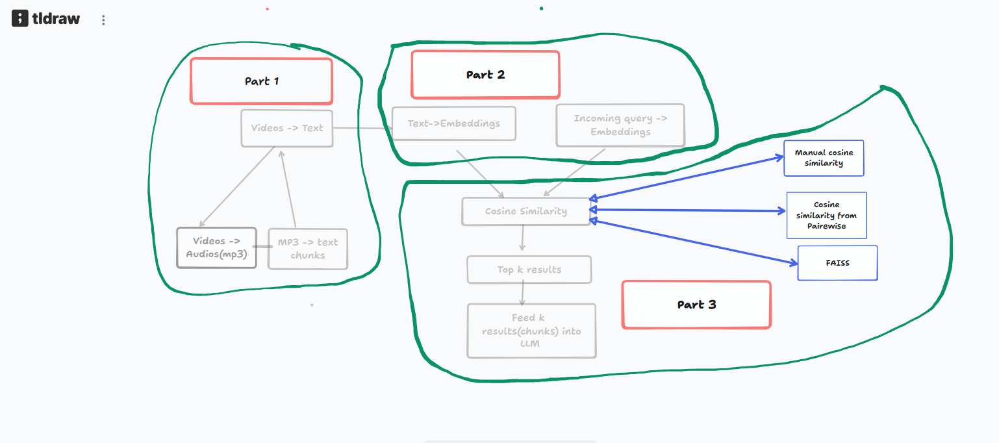

# Local RAG System (Whisper + Ollama + FAISS)

A fully local **Retrieval-Augmented Generation (RAG)** pipeline built using Python, Whisper, Ollama embeddings, cosine similarity search, and FAISS.
The system converts video lectures into searchable knowledge and allows users to ask questions that are answered using retrieved context and an LLM.

This project demonstrates the **core architecture used in modern AI search systems**.

---

# Project Overview

The pipeline performs the following steps:

# Project Overview

The pipeline performs the following steps:

1. **Video to Audio Conversion**

   - Lecture videos are converted to audio files using **ffmpeg**.

2. **Audio Transcription**

   - Audio files are converted into text using **Whisper**.

3. **Chunking**

   - Transcripts are split into smaller chunks with metadata.

4. **Embeddings**

   - Each chunk is converted into a vector embedding using the **bge-m3 embedding model** from Ollama.

5. **Vector Storage**

   - Embeddings are stored in a Pandas DataFrame and cached using **joblib** to avoid recomputation.

6. **Retrieval**

   - Multiple retrieval approaches are implemented:

     - Manual cosine similarity using NumPy
     - Cosine similarity using sklearn
     - FAISS vector index

7. **Generation**

   - Retrieved chunks are provided as context to an LLM (**llama3**) using Ollama to generate the final answer.

---

# Architecture

```
Video Files
     │ 
     ▼
ffmpeg from Whisper
     │ 
     ▼
Audio Files
     │
     ▼
Whisper Transcription
     │
     ▼
Chunked JSON Files
     │
     ▼
Embedding Generation (bge-m3)
     │
     ▼
Embedding Cache (joblib)
     │
     ▼
Vector Retrieval
  ├── NumPy Cosine Similarity
  ├── sklearn Cosine Similarity
  └── FAISS Index
     │
     ▼
Top-K Retrieved Chunks
     │
     ▼
LLM Prompt Construction
     │
     ▼
Answer Generation (llama3)
```

---

# Architectural Drawing
 
 

# Tech Stack

* Python
* Whisper
* ffmpeg
* Ollama
* bge-m3 Embeddings
* Llama3
* NumPy
* Pandas
* FAISS
* scikit-learn
* joblib

---


# Installation

### 0. Video to Audio Conversion
Lecture videos are converted to audio using **ffmpeg** before transcription.
```
ffmpeg -i input_video.mp4 output_audio.mp3
```

### 1. Clone the repository

```
https://github.com/Swarnava04/AI-Video-Recognizer.git
cd '<Your_folder_name>'
```

---

### 2. Install dependencies

```
pip install pandas numpy scikit-learn faiss-cpu joblib
```

Install Whisper separately if needed.

---

### 3. Install Ollama

Download Ollama:

```
https://ollama.com
```

Pull the required models:

```
ollama pull bge-m3
ollama pull llama3
```

---

# Running the Project

### Step 1 — Build Embeddings

```
python build_embeddings.py
```

This will:

* generate embeddings
* cache them using joblib

---

### Step 2 — Run Retrieval

Example cosine similarity search:

```
python cosine_search_process_1.py
```

---

### Step 3 — Run Full RAG Pipeline

```
python rag_pipeline.py
```

Example query:

```
Ask a question:
What is agentic AI?
```

The system will:

1. Embed the query
2. Retrieve top-k relevant chunks
3. Construct a prompt
4. Generate an answer using the LLM

---

# Example Output

```
Retrieved Context

Video_3 | similarity: 0.91
Video_7 | similarity: 0.88
Video_2 | similarity: 0.83

Final Answer

Agentic AI refers to systems where an AI model can perceive information,
reason over it and perform actions autonomously using large language models.
```

---

# Retrieval Methods Implemented

## Manual Cosine Similarity (NumPy)

Uses matrix multiplication:

```
similarities = embedding_matrix @ query_vector
```

Efficient vectorized implementation for small datasets.

---

## sklearn Cosine Similarity

Uses:

```
sklearn.metrics.pairwise.cosine_similarity
```

Provides a simpler API but slightly slower than NumPy.

---

## FAISS Vector Search

Uses Facebook's FAISS library for fast nearest neighbor search.

```
index = faiss.IndexFlatIP(dimension)
index.add(embeddings)
```

Supports scaling to millions of vectors.

---

# Caching Strategy

Embedding generation is expensive.

To avoid recomputing embeddings on every run:

```
joblib.dump(df, "chunks_embeddings.joblib")
```

Subsequent runs load cached embeddings instantly.

---

# Key Concepts Demonstrated

* Retrieval-Augmented Generation (RAG)
* Embedding-based search
* Cosine similarity
* Vector indexing
* LLM prompt engineering
* Efficient embedding caching

---

# Future Improvements

Possible enhancements for this system:

* Chunk overlap for better retrieval
* Hybrid search (BM25 + embeddings)
* Streaming LLM responses
* Re-ranking models
* Better context window management
* Web UI for interactive querying

---

# Learning Outcomes

This project demonstrates how modern AI systems perform **semantic search and question answering** using vector embeddings and LLMs.

The same architecture is used in many real-world systems including:

* knowledge assistants
* document Q&A systems
* enterprise search tools

---

# License

This project was created as a **personal learning project** and is shared for educational purposes.
